### TP 2

I. Exploration locale en solo

1. Affichage d'informations sur la pile TCP/IP locale

utilisation de ipconfig /all

nom, adresse MAC et adresse IP de l'interface WiFi :

    - Carte réseau sans fil Wi-Fi
    
    - 60-FF-9E-63-94-D1

    - 10.33.69.72

nom, adresse MAC et adresse IP de l'interface Ethernet

    - Carte Ethernet Ethernet 2 
    
    - 0A-00-27-00-00-02

    - 192.168.56.1
    
déterminer, pour chacune d'entre elles :

    adresse de réseau :

        - 10.33.64.0

    adresse de broadcast :

        - 10.33.79.255

Affichez votre gateway

    - ipconfig 

    - 10.33.79.254

## En graphique (GUI : Graphical User Interface)

En utilisant l'interface graphique de votre OS :
Trouvez comment afficher les informations sur une carte IP (change selon l'OS) :

    - paramètre, réseau et internet, wifi, WIFI@YNOV

trouvez l'IP, la MAC et la gateway pour l'interface WiFi de votre PC

## Questions : à quoi sert la gateway dans le réseau d'Ingésup ?

    - La gateway du réseau d'Ingésup sert d'intermédiaire en ce réseau et les autres pour communiquer.

2. Modifications des informations

### A. Modification d'adresse IP - pt. 1

Utilisez l'interface graphique de votre OS pour changer d'adresse IP :

calculez la première et la dernière IP disponibles du réseau (pour rappel, l'adresse de réseau et l'adresse broadcast ne sont pas "disponibles")

    - Première IP dispo : 10.33.64.1

    - Dernière IP dispo : 10.33.79.254

changez l'adresse IP de votre carte WiFi pour une autre (mais toujours dans le même réseau)

### B. nmap

vérification de l'installation :

    - nmap --version

trouvez les hôtes actuellement sur le réseau :

    - nmap -sn -PE 10.33.64.0

### C. Modification d'adresse IP - pt. 2

Modifiez de nouveau votre adresse IP vers une adresse IP que vous savez libre grâce à nmap

Modifiez votre adresse de gateway et essayez d'aller sur un site internet

On remarque que l'on ne peut plus accéder à internet car la gateway ne correspond pas à celle du réseau.

II. Exploration locale en duo

1. Prérequis

- Deux PC avec ports RJ45
- Un câble RJ45
- Firewalls désactivés sur les deux PC

2. Câblage

- Branchement des deux PC avec ports RJ45

3. Modification d'adresse IP

- Modifiez l'IP des deux machines pour qu'elles soient dans le même réseau. Exemples :

  - PC1 : 

  - PC2 : 

- Vérifiez à l'aide des commandes adaptées :

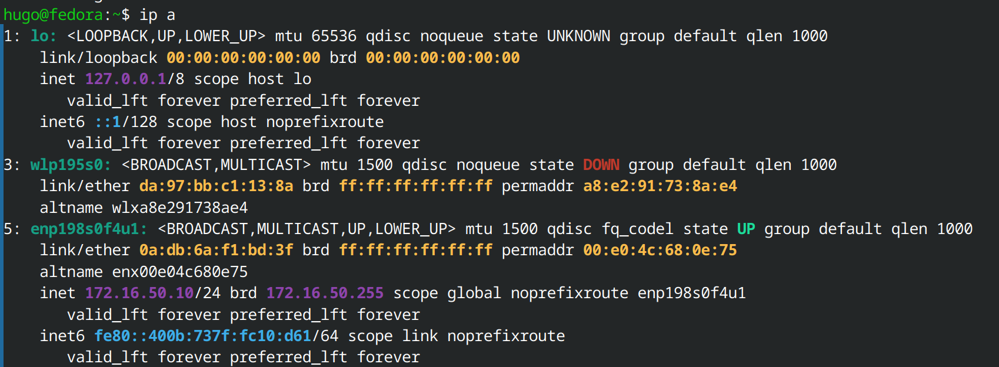

- Testez la connectivité entre les deux machines avec `ping` :

  - PC1 -> PC2 : 

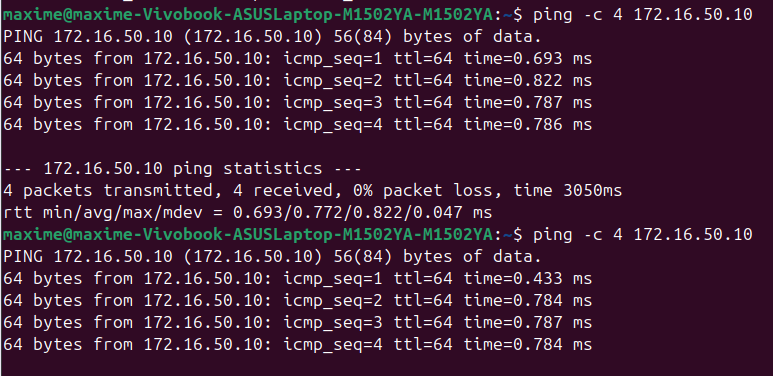

  - PC2 -> PC1 : 

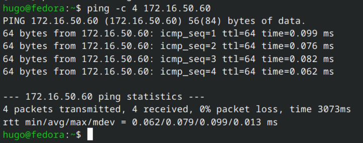

- Exercice : inventez un nouveau réseau (ex : `172.16.18.0/24`) et attribuez des adresses aux deux PC.

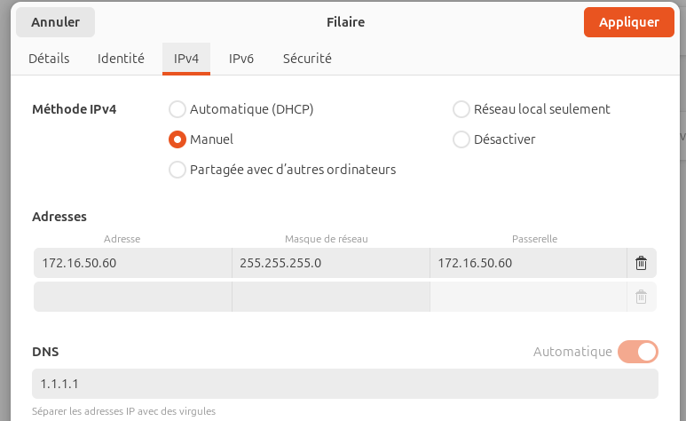

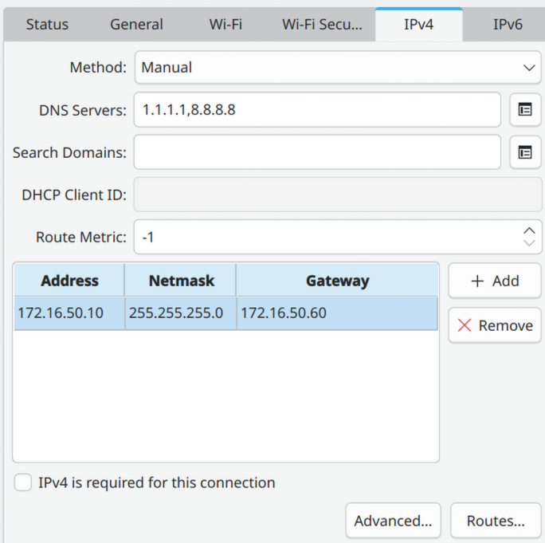

4. Utilisation d'un des deux comme gateway

- Désactivez l'interface WiFi sur l'un des postes.
- Sur le PC qui n'a plus Internet (PC2), configurez comme passerelle l'adresse IP de l'autre PC (PC1).
- Sur le PC qui a Internet (PC1), activez le routage/partage :

  - Linux (temporaire) : `sudo sysctl -w net.ipv4.ip_forward=1`
  - Ou activez le partage via Network Manager / l'interface graphique.

- Pour tester l'accès Internet depuis PC2 : `ping 8.8.8.8`.

5. Petit chat privé ?

L'un fait office de serveur, l'autre de client. Utilisez `netcat` (`nc`) :

- Sur le PC serveur (ex : 192.168.1.1) écoutez sur un port :

  - Linux: `nc -l 8888`

- Sur le PC client : `nc 192.168.1.1 8888`

6. Wireshark

- Capturez les trames entre vos deux cartes Ethernet pendant :

  - un `ping`

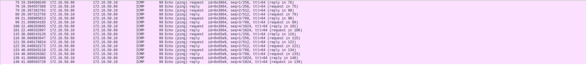
  
  - une session `netcat`

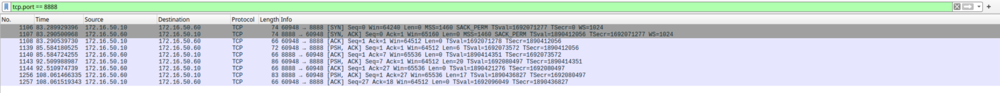

7. Firewall

- Travaillez par paires :

  - Activez le firewall et autorisez le ping (ICMP type 8/0).

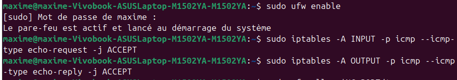

  - Autorisez `nc` sur un port choisi entre `1024` et `20000`.

 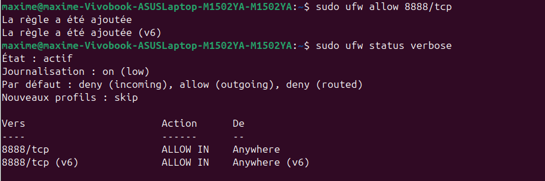 

- Testez la communication `netcat` avec le firewall activé sur le PC serveur.

III. Manipulations d'autres outils/protocoles côté client

1. DHCP

afficher l'adresse IP du serveur DHCP du réseau WiFi : 

    - ipconfig /all

Trouver la date d'expiration de votre bail DHCP :

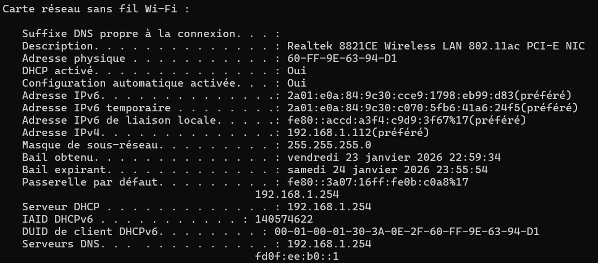

Fonctionnement du DHCP dans les grandes lignes :

    -Le DHCP est un protocole ayant pour but d’attribuer, durant un certain temps (appelé un bail), une adresse IP aux différents éléments qui se connectent au réseau.
    -En rendant l’attribution des adresses automatique, il permet d’assigner une adresse unique à chaque élément et d’éviter que plusieurs équipements aient la même adresse IP.

Demandez une nouvelle adresse IP (en ligne de commande) :

    On utilise les commande "ipconfig /release" et "ipconfig /renew".

    - avant :

    - après :

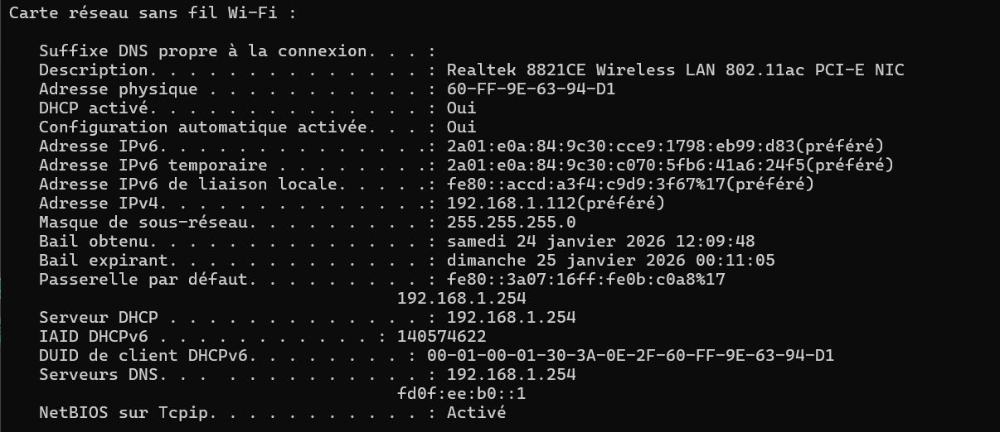    

    L'adresse est rester la même suite au fonction du DHCP de chez moi mais on remarque que le bail a bien changer.
    Ainsi l'operation a bien eu lieu.

2. DNS

trouver l'adresse IP du serveur DNS que connaît votre ordinateur :

    - on constate que l'adresse IP du serveur DNS est 192.168.1.254

en ligne de commande avec l'outil nslookup, trouver:

    - pour google.com

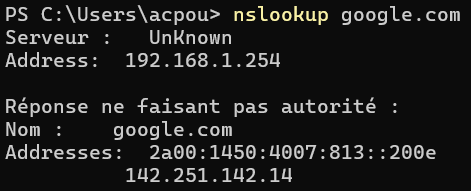   

    - pour ynov.com

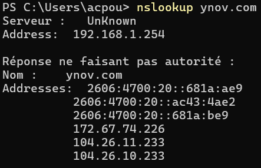   

interpréter les résultats de ces commandes :

    - Le DNS renvoie une ou plusieurs IPs correspondant au nom de domaine donné.
    - Dans le cas de google.com, on en retourve qu'une adresse.
    - Dans le cas de ynov.com, on en retourve plusieurs adresses surment pour le trafic sur plusieurs serveur.
    - Les serveur sont dis UnKnown car il n'y a pas de nom enregistrer pour le routeur domestique de ma maison.

faites un reverse lookup (= "dis moi si tu connais un nom de domaine pour telle IP")

    pour l'adresse 78.78.21.21 :

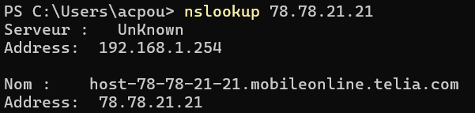       

    pour l'adresse 92.16.54.88 :

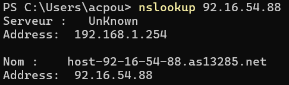        

    interprétetation des résultats :

    - Le DNS renvoie cette fois le nom relier au adresse IP.
    - Dans le cas de 78.78.21.21, on en retourve "telia.com" un site de produis informatique suedois.
    - Dans le cas de 92.16.54.88, on en retourve as13285.net, un nom de domaine a acheter.
    - Les serveur sont dis UnKnown car il n'y a pas de nom enregistrer pour le routeur domestique de ma maison.

3. Bonus : aller plus loin

ouvrir Wireshark pendant les requêtes DHCP et DNS et se renseigner sur les différences entre WiFi et câble :

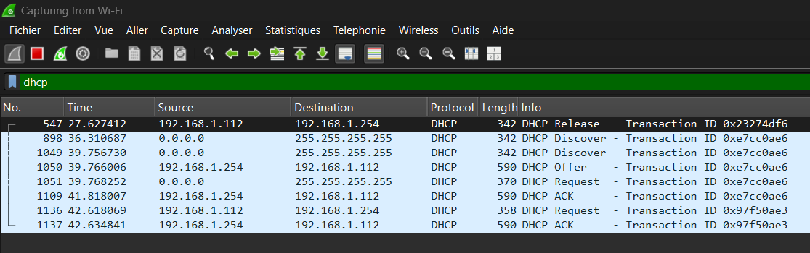 

    Wifi :
        -plus lent
        -plus de latence
        -onde envoyer

    cable :
        -plus rapide
        -moins de latence
        -connection physique

explorer l'interface d'administration de votre box (chez vous) avec tout ça en tête 

A quoi la MAC si on a des IP ? => Se renseigner sur ARP :

    -Le protocole Arp sert a retrouver une adresse MAC quand on a une adresse IP.
    -On peut utiliser la commande "arp -a" pour retrouver les IP, l'adresse MAC associé et enfin le type ( Dynamique ou statique)

utiliser un switch (physique) et se connecter non pas à 2, mais à 3 ou 4 ou 5 et faire mumuse avec le réseau ainsi créé :

utiliser un switch (physique) et se connecter non pas à 2, mais à 3 ou 4 ou 5 et faire mumuse avec le réseau ainsi créé :
