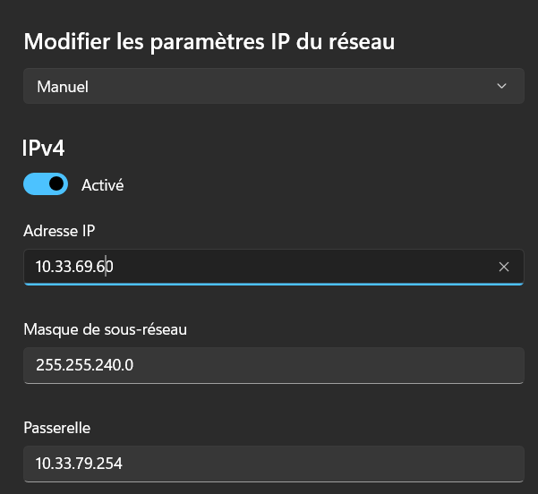
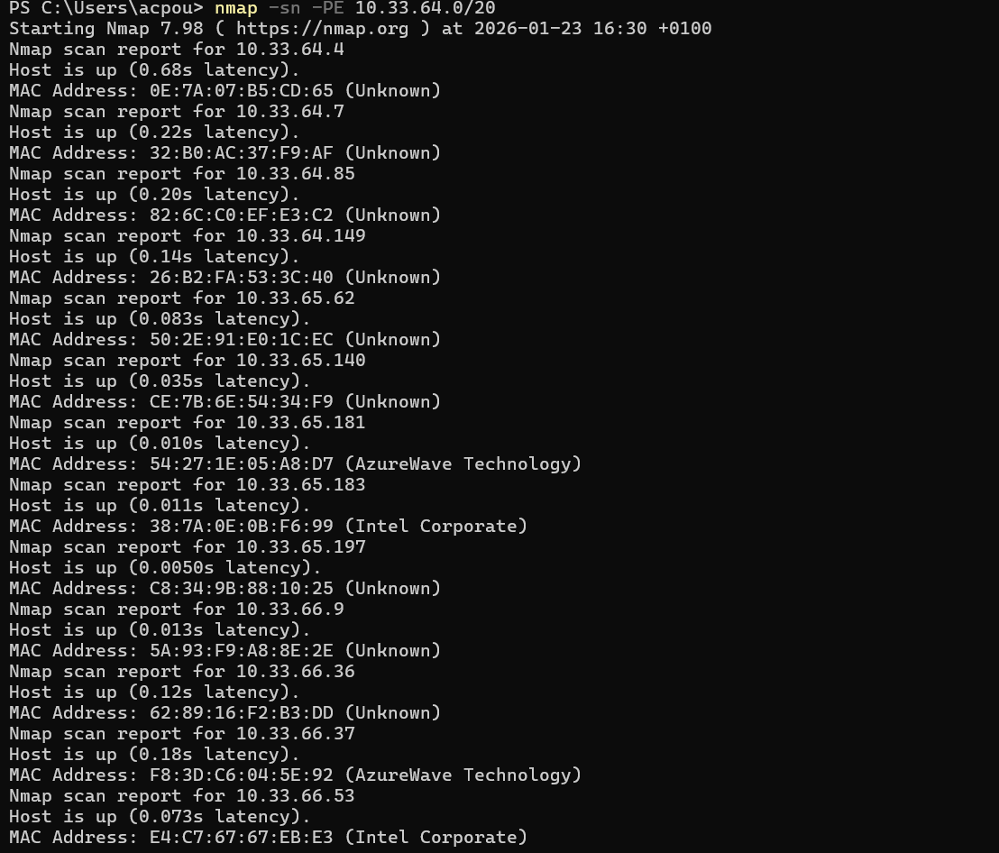
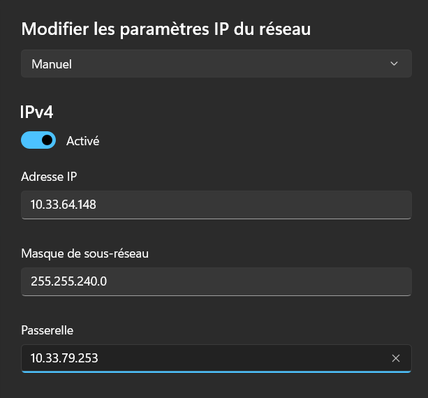
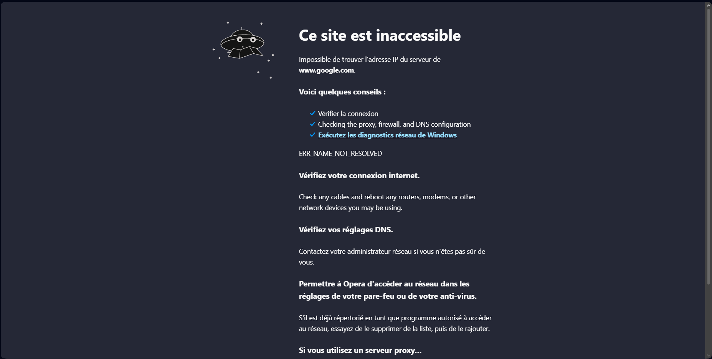

# TP 2 

I. Exploration locale en solo

1. Affichage d'informations sur la pile TCP/IP locale

utilisation de ipconfig /all

nom, adresse MAC et adresse IP de l'interface WiFi :

    - Carte réseau sans fil Wi-Fi
    
    - 60-FF-9E-63-94-D1

    - 10.33.69.72

nom, adresse MAC et adresse IP de l'interface Ethernet

    - Carte Ethernet Ethernet 2 
    
    - 0A-00-27-00-00-02

    - 192.168.56.1
    
déterminer, pour chacune d'entre elles :

    adresse de réseau :

        - 10.33.64.0

    adresse de broadcast :

        - 10.33.79.255

Affichez votre gateway

    - ipconfig 

    - 10.33.79.254

# En graphique (GUI : Graphical User Interface)

En utilisant l'interface graphique de votre OS :
Trouvez comment afficher les informations sur une carte IP (change selon l'OS) :

    - paramêtre, réseau et internet, wifi, WIFI@YNOV

trouvez l'IP, la MAC et la gateway pour l'interface WiFi de votre PC

# Questions : à quoi sert la gateway dans le réseau d'Ingésup ?

    - La gateway du réseau d'Ingésup sert d'intermediaire en ce réseau et les autres pour communiquer.

2. Modifications des informations

A. Modification d'adresse IP - pt. 1

Utilisez l'interface graphique de vorte OS pour changer d'adresse IP :

calculez la première et la dernière IP disponibles du réseau (pour rappel, l'adresse de réseau et l'adresse broadcast ne sont pas "disponibles")

    - Première IP dispo : 10.33.64.1

    - Dernière IP dispo : 10.33.79.254

changez l'adresse IP de votre carte WiFi pour une autre (mais toujours dans le même réseau)

B. nmap

vérification de l'tinstallation :

    - nmap --version

trouvez les hôtes actuellements sur le réseau :

    - nmap -sn -PE 10.33.64.0

C. Modification d'adresse IP - pt. 2

Modifiez de nouveau votre adresse IP vers une adresse IP que vous savez libre grâce à nmap

Modifiez votre adresse de gateway et essayez d'aller sur un site internet

