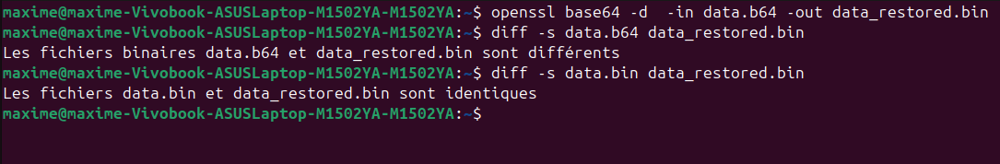
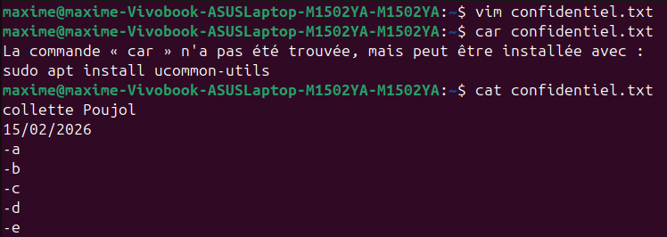
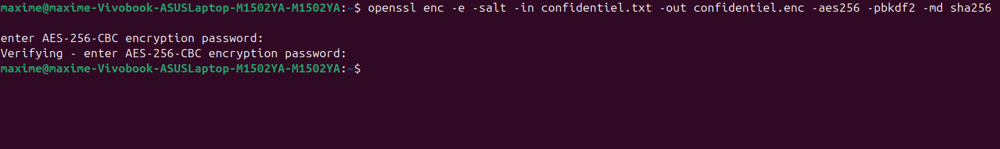
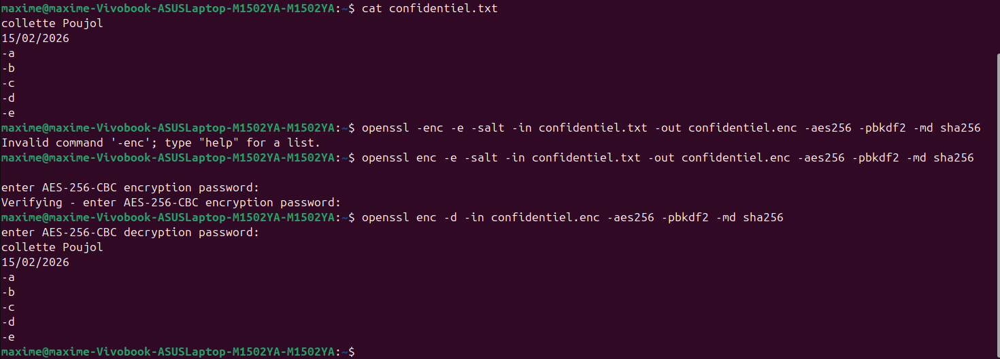
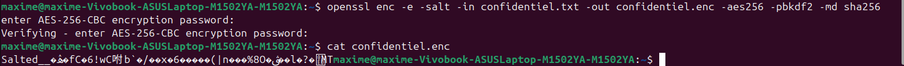
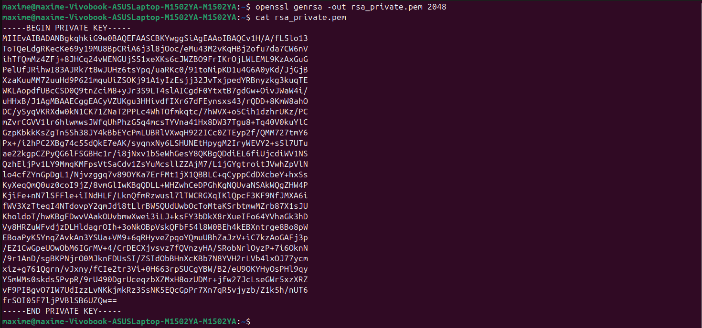
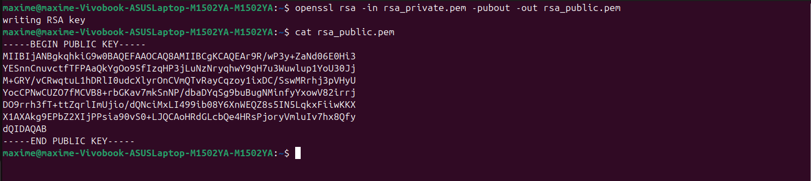
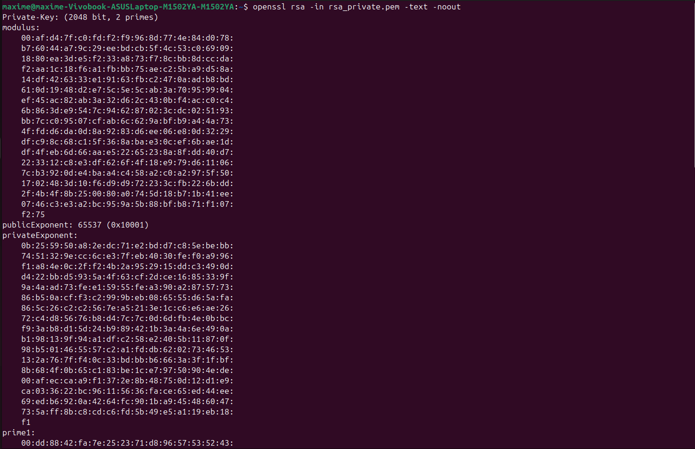
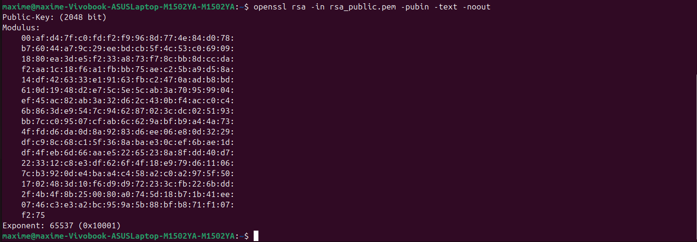
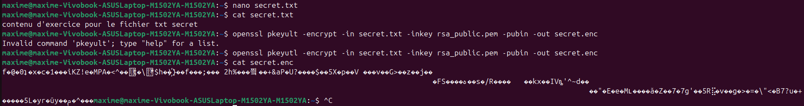

# TP 3

I. Sans que je vous donne les réponses à chaque étape

    A. Base64

        1. Génération d’un fichier binaire

        Créer un fichier `data.bin` contenant 100 Ko de données binaires aléatoires.
        Vérifier sa taille.

        2. Encodage

        Encoder le fichier en Base64 dans un fichier `data.b64`.
        Afficher son contenu.
        Comparer la taille de `data.bin` et `data.b64`.

        3. Décodage

        Décoder le fichier `data.b64` afin d’obtenir un fichier `data_restored.bin`.
        Vérifier que `data.bin` et `data_restored.bin` sont strictement identiques.

        4. Questions

            Base64 est-il un chiffrement ? Pourquoi ?

                - C'est un chiffrement car il fait passer une donnée d'un stade A non crypté vers un stade B, lui crypté et nécessitant une technique spéciale pour réobtenir la donnée dans son stade A.

            Pourquoi la taille du fichier change-t-elle après encodage ?

                - Le modèle Base64 convertit des données en caractères de texte. Comme la taille d'un caractère représente moins que celle d'une donnée, il faut plusieurs caractères pour encoder une donnée.

            Quel est approximativement le pourcentage d’augmentation ?

                - Elle augmente d'environ 30 %.

            Quelle méthode permet de vérifier rigoureusement que deux fichiers sont identiques ?

                - On peut utiliser la méthode `diff` qui indique si les deux fichiers sont identiques ou non.

    B. Chiffrement symétrique – AES

        1. Création d’un message

            Créer un fichier `confidentiel.txt` contenant :

            Votre nom
            La date
            5 lignes minimum

        2. Chiffrement

            Chiffrer le fichier avec :

            - AES 256
            - Un sel
            - Une dérivation de clé robuste
            - Un algorithme de hachage sécurisé

            Le fichier chiffré devra s’appeler :
            `confidentiel.enc`
            Vérifier que le fichier obtenu est bien binaire.

        3. Déchiffrement

            Déchiffrer le fichier vers :
            `confidentiel_dechiffre.txt`
            Vérifier que le contenu correspond exactement à l’original.

        4. Analyse

            Chiffrer une seconde fois le même fichier avec le même mot de passe.
            Comparer les deux fichiers chiffrés.

            - On peut constater que les deux versions du fichier `confidentiel.enc` sont différentes.

        5. Questions

            Pourquoi les deux fichiers chiffrés sont-ils différents ?

                - Pour garantir la sécurité autour des données qu'on chiffre, il faut changer la clé de chiffrement à chaque fois pour éviter qu'une vieille clé puisse être réutilisée sur les nouveaux chiffrements.

            Quel est le rôle du sel ?

                - Le sel est la partie qui permet d'éviter que deux fichiers chiffrés avec un même mot de passe aient le même chiffrement.

            Que se passe-t-il si une option change lors du déchiffrement ?

                - Si les options changent, la clé sera incorrecte et le déchiffrement échouera.

            Pourquoi utilise-t-on PBKDF2 ?

                - PBKDF2 est un algorithme pour dériver les clés de chiffrement à partir du mot de passe.

            Quelle est la différence entre encodage et chiffrement ?

                - L'encodage correspond à la transformation d'une donnée vers un autre format ; cela n'empêche personne de la lire.

                - Le chiffrement protège l'information avec une clé et un mot de passe, changeant sa forme et empêchant quiconque ne disposant pas des informations nécessaires de lire le contenu.

    C. Cryptographie asymétrique – RSA

        1. Génération de clés

            Générer une paire de clés RSA 2048 bits :

            `rsa_private.pem`
            `rsa_public.pem`

            Protéger la clé privée par un chiffrement.
            Afficher les paramètres détaillés de la clé privée.
            Afficher les paramètres de la clé publique.
            Comparer les deux.

        - On remarque que la partie privée est composée de : modulus, publicExponent, privateExponent, prime 1 et prime 2, exponent 1 et exponent 2, et coefficient.

        - Alors que la clé publique ne contient que modulus et publicExponent.

        2. Chiffrement asymétrique

            Créer un fichier `secret.txt`.
            Chiffrer ce fichier avec la clé publique.
            Le fichier chiffré devra s’appeler :
            `secret.enc`

            Déchiffrer ensuite avec la clé privée.

        3. Questions

            Pourquoi la clé privée ne doit-elle jamais être partagée ?

                - Parce qu'elle assure la sécurité ; si tout le monde l'a, tout le monde peut consulter les données chiffrées.

            Pourquoi RSA n’est-il pas adapté au chiffrement de gros fichiers ?

                - Le RSA est un protocole qui nécessite de nombreux calculs ; chiffrer de grandes quantités de données avec RSA peut être très long.

            Quelles différences observe-t-on entre les paramètres d’une clé publique et d’une clé privée ?

                - La clé publique comporte beaucoup moins d'informations car elle est accessible à tous. La clé privée doit contenir toutes les informations sensibles à ne pas partager.

            Quel est le rôle du modulo dans RSA ?

                - Le modulo est la base des opérations de chiffrement et de déchiffrement en RSA.

            Pourquoi utilise-t-on souvent RSA pour chiffrer une clé AES plutôt qu’un document entier ?

                - Vu que le RSA ne peut chiffrer qu'une petite quantité de données, on peut chiffrer une clé AES qui, elle, pourra chiffrer une grande quantité.

    D. Signature numérique

        1. Création et signature

            Créer un fichier `contrat.txt`.
            Générer son empreinte (hash).
            Signer le fichier avec votre clé privée.
            Le fichier de signature devra s’appeler :
            `contrat.sig`

        2. Vérification

            Vérifier la signature avec la clé publique.
            Modifier légèrement le fichier `contrat.txt`.
            Refaire la vérification.

        3. Questions

            Que se passe-t-il après modification du fichier ?

                - Cela renvoie un message : "Verification Failure"

            Pourquoi ?

                - Parce que la signature est liée au hash exact du fichier et non à sa version modifiée.

            Quel est le rôle du hachage dans le mécanisme de signature ?

                - Le hachage permet de transformer des données en une empreinte de taille fixe. Il contribue à assurer la sécurité des données.

            Quelle différence entre signature numérique et chiffrement ?

                - Le chiffrement protège la confidentialité et donc le contenu des fichiers.

                - La signature numérique permet de garantir l'authenticité d'un fichier et son intégrité.

