# TP4 – Administration SSH et Serveur Web Nginx

---

## Partie 1 – Mise en place de l'environnement virtualisé

### 1.1 Installation de la VM Ubuntu

Installez VirtualBox et créez une VM Ubuntu :

- **RAM** : 2 Go minimum
- **Disque** : 20 Go
- **Réseau** : Bridged Adapter

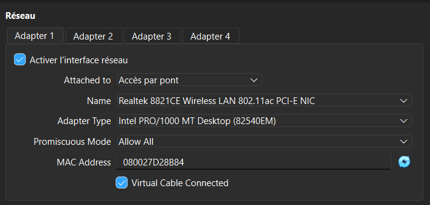

### 1.2 Vérification de la connectivité réseau

Vérifiez que la VM a une IP accessible depuis la machine hôte avec les commandes :


-`ip a`
-`ping <IP_VM>`


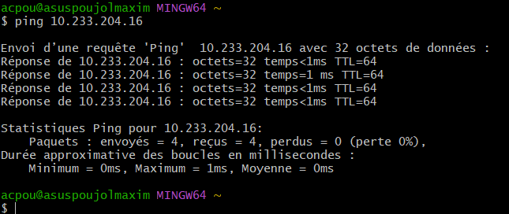

---

## Partie 2 – Serveur SSH

### 2.1 Installation du serveur SSH

Installez le serveur SSH sur la VM avec les commandes :


-sudo apt update
-sudo apt install openssh-server


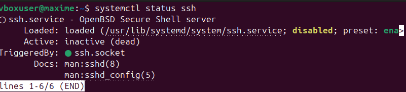

### 2.2 Vérification du service SSH

Vérifiez que le service SSH fonctionne et écoute sur un port avec les commandes :

-`systemctl status`
-`ss` ou `netstat`


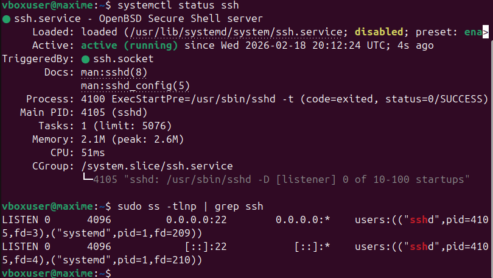

### 2.3 Connexion SSH depuis la machine hôte

Connectez-vous depuis la machine hôte :


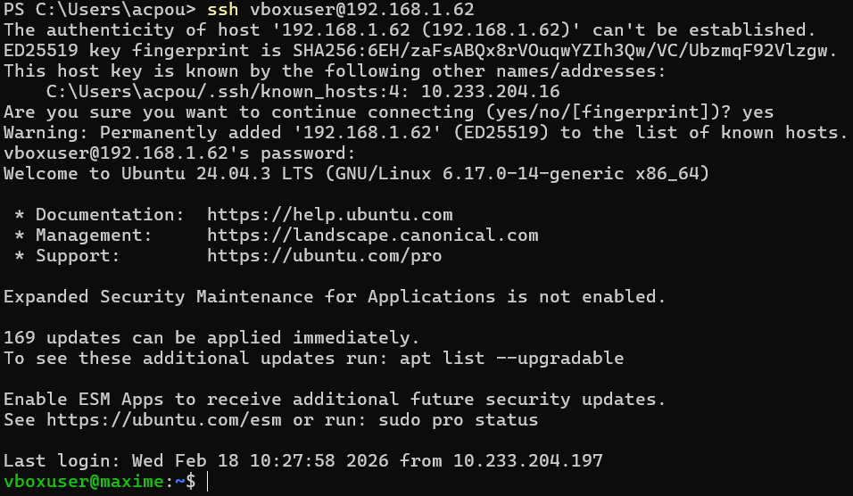

### 2.4 Authentification par clé SSH

Générez une clé SSH sur la machine cliente et copiez-la sur le serveur pour tester la connexion sans mot de passe.

Générer et copier une clé avec les commandes : `ssh-keygen`, `ssh-copy-id`


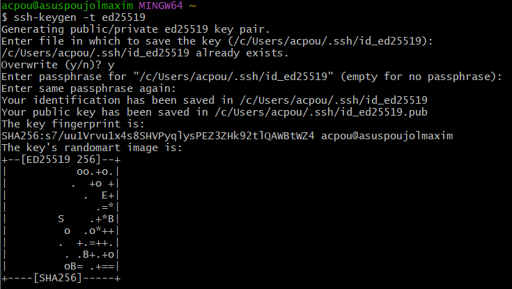


---

## Partie 3 – Sécurisation SSH

### 3.1 Modification de la configuration SSH

Modifiez la configuration SSH sur le serveur pour renforcer la sécurité :

1. **Interdisez l'accès root**
2. **Désactivez l'authentification par mot de passe**
3. **Changez le port par défaut (22)** pour réduire les tentatives de brute-force

recherchez le fichier `/etc/ssh/sshd_config` et les options `PermitRootLogin`, `PasswordAuthentication`


Modifications à effectuer :

-Port 2222
-PermitRootLogin no
-PasswordAuthentication no


### 3.2 Redémarrage et test

Redémarrez le service SSH et testez la connexion avec le nouveau port depuis la machine cliente.

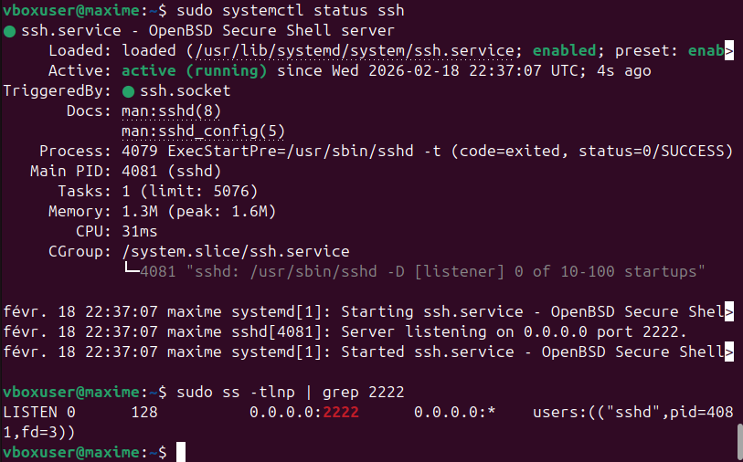


### 3.3 Création d'un alias SSH

Créez un alias SSH dans `~/.ssh/config` pour simplifier les connexions.


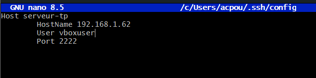

---

## Partie 4 – Transfert de fichiers

### 4.1 Transfert avec SCP

Transférez un fichier depuis la machine cliente vers le serveur :


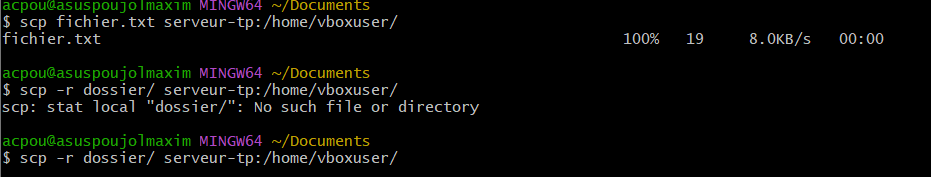

### 4.2 Transfert avec SFTP

Explorez les commandes `put`, `get`, `ls` pour transférer et naviguer sur le serveur.

Commandes SFTP :

-ls
-put fichier.txt
-get fichier_distant.txt


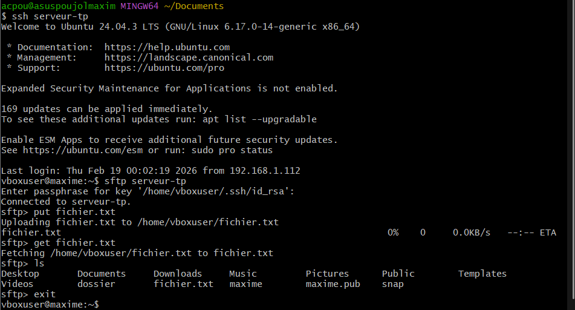

### 4.3 Synchronisation avec RSYNC

Synchronisez un dossier entre client et serveur.


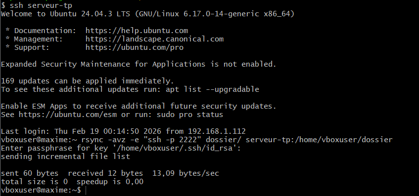

---

## Partie 5 – Analyse des logs et sécurité

### 5.1 Suivi des logs d'authentification

Suivez les logs d'authentification pour observer les connexions SSH avec la commande :


-sudo tail -f /var/log/auth.log


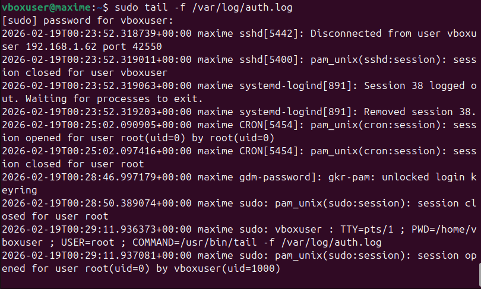

### 5.2 Installation et configuration de Fail2Ban

Installez Fail2Ban et testez un bannissement après plusieurs tentatives échouées avec les commandes :


-sudo apt install fail2ban
-sudo systemctl enable fail2ban
-sudo systemctl start fail2ban


Configuration :


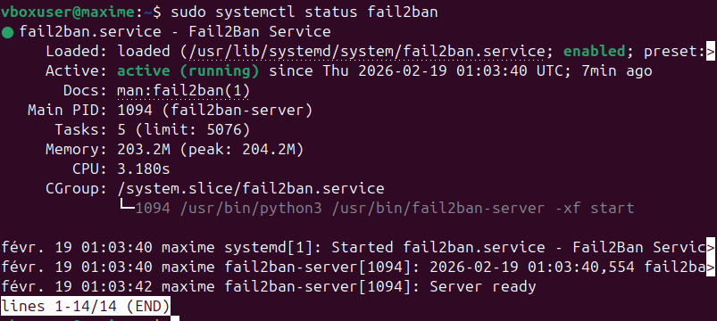

Vérification avec la commande :

-sudo fail2ban-client status sshd


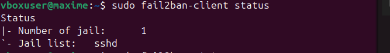

---

## Partie 6 – Tunnel SSH

### 6.1 Tunnel local

Créez un tunnel local pour accéder à un service web distant depuis la machine cliente avec la commande :


-ssh -L 8080:localhost:80 serveur-tp


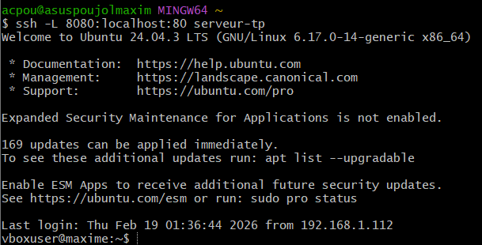
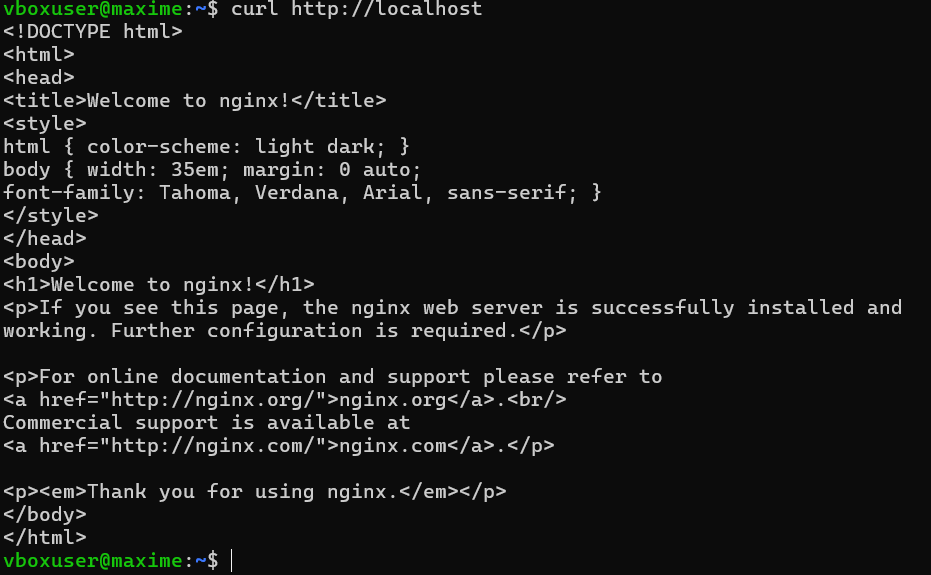
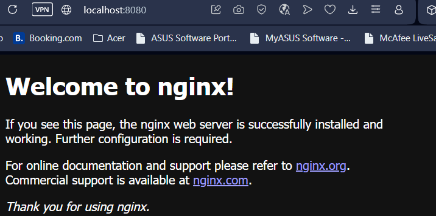

### 6.2 Tunnel distant

Créez un tunnel distant pour permettre l'accès SSH au client via le serveur avec la commande :


-ssh -R 9090:localhost:22 serveur-tp


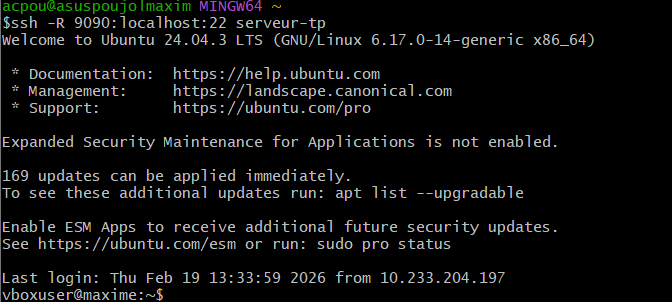

---

## Partie 7 – Nginx et HTTPS

### 7.1 Installation de Nginx

Installez Nginx sur la VM avec les commandes :


-sudo apt install nginx
-sudo systemctl enable nginx
-sudo systemctl start nginx


### 7.2 Création du site test

Créez un site test dans `/var/www/site-tp` et un fichier `index.html` avec un message de bienvenue.


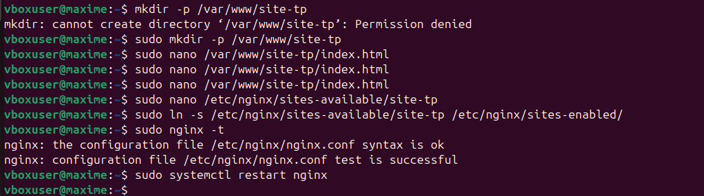

### 7.3 Configuration Nginx pour HTTP

Configurez Nginx pour servir ce site sur HTTP.

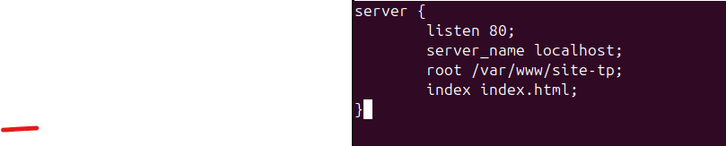

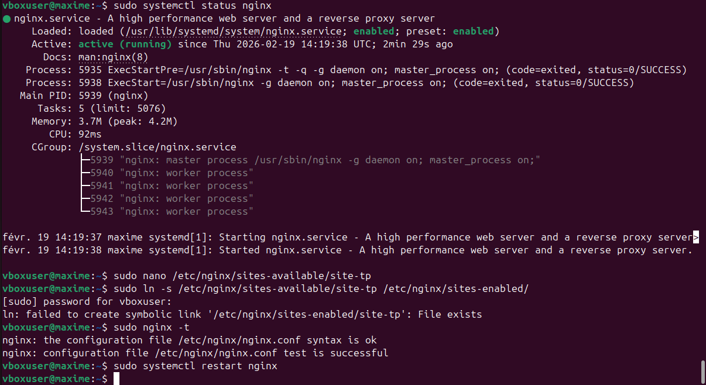

### 7.4 Génération du certificat SSL

Générez un certificat auto-signé pour HTTPS.

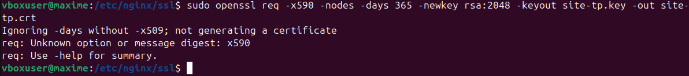

### 7.5 Configuration HTTPS avec redirection

Configurez la redirection HTTP → HTTPS.


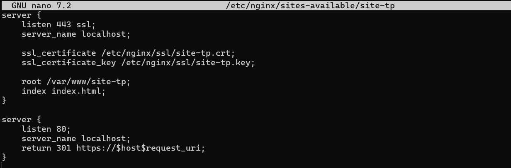

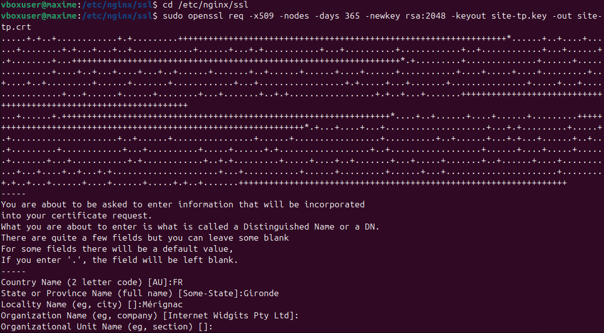


### 7.6 Test du site HTTPS

Testez le site depuis le client :

```bash
curl -k https://<IP_VM>
```

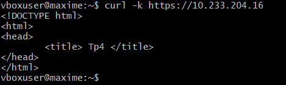

---

## Partie 8 – Firewall et permissions

### 8.1 Configuration du firewall UFW

Autorisez Nginx dans le firewall (ports HTTP/HTTPS).

**Piste** :
```bash
sudo ufw enable
sudo ufw allow 'Nginx Full'
sudo ufw allow 2222/tcp
sudo ufw status
```

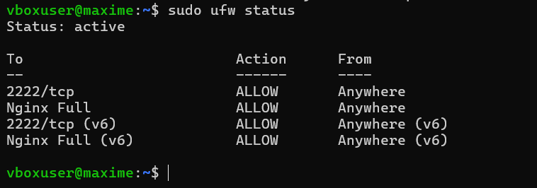


### 8.2 Vérification des permissions

Vérifiez les permissions sur `/var/www/site-tp` pour que Nginx puisse lire les fichiers.

**Pistes** : utiliser `chown` et `chmod` pour définir le propriétaire et les droits.

```bash
sudo chown -R www-data:www-data /var/www/site-tp
sudo chmod -R 755 /var/www/site-tp
ls -la /var/www/site-tp
```

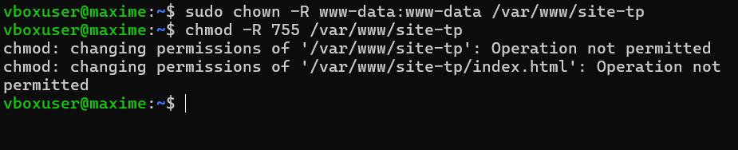

---

## Partie 9 – Validation finale

### Tests finaux


Test SSH :
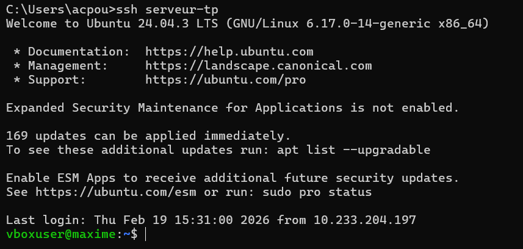

Test Fail2Ban :
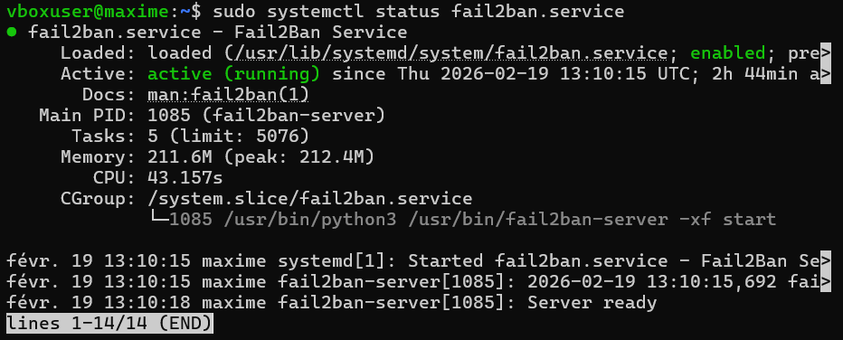

Test Nginx :
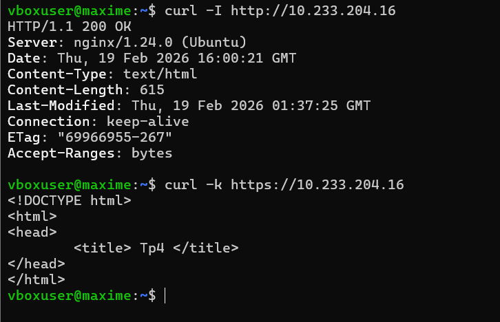

Test transfert:
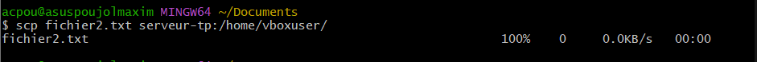

Test firewall:
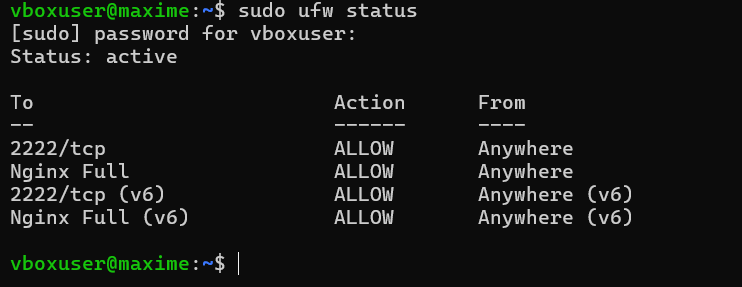

---

**Fin du TP4**
