### TP5 : pfSense – Bases d’un pare-feu

Ce Tp est moins facile que les précédents, n'hésitez pas à m'appeler en cas de blocage.
Objectifs

Mise en place d'un lab avec plusieurs VMs
Installation et configuration d'un pfSense
Donner accès à Internet à une VM Ubuntu via pfSense
Sécuriser l’administration du pare-feu
Comprendre la logique des règles
Manipuler NAT, DHCP et DNS
Mettre en place un filtrage ciblé

# Partie 1 – Prise en main et sécurisation

1. Accès à l’interface

Connectez-vous à l’interface web de pfSense.

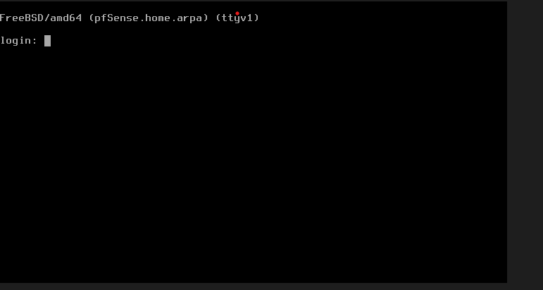

Questions :

Quelle est l’adresse IP du LAN  ?

    -192.168.56.103

Quelle est l’adresse IP du WAN ?

    -10.0.2.15

Pourquoi utilise-t-on HTTPS ?

    -Parce c'est sécurisé.

Pourquoi faut-il changer les identifiants par défaut sur un pare-feu ?

    - Parce que si on ne change pas, on garde ceux par defaut que tout le monde possède  et connait

2. Sécurisation de l’accès administrateur

Modifiez les paramètres du compte administrateur.

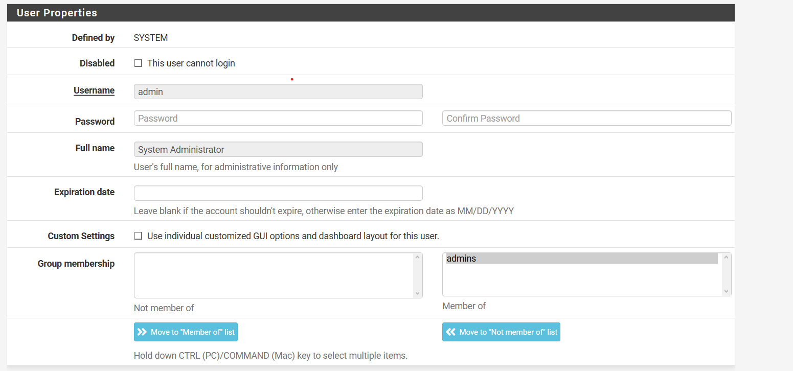

Questions :

Où se gèrent les utilisateurs ?

    -

Qu’est-ce qu’un mot de passe robuste ?

    - Un mots de passe unique, avec des caractère de différent type 

Pourquoi sécuriser en priorité l’accès admin sur un équipement réseau ?

    - Parce que l'admin possède tout les droits et certains que ne doivent pas être partagé

# Partie 2 – Comprendre les interfaces réseau

3. Vérification des interfaces

Vérifiez l’affectation WAN / LAN.

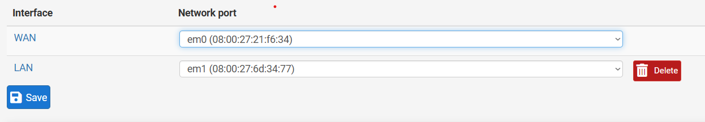

Questions :

Quelle interface permet l’accès Internet ?

    - Le WAN

Quelle interface correspond au réseau interne ?

    - Le LAN

Que se passerait-il si les interfaces étaient inversées ?

    - Plus rien ne marche

# Partie 3 – Configuration des services réseau

4. DHCP

Configurez le serveur DHCP pour le réseau LAN.

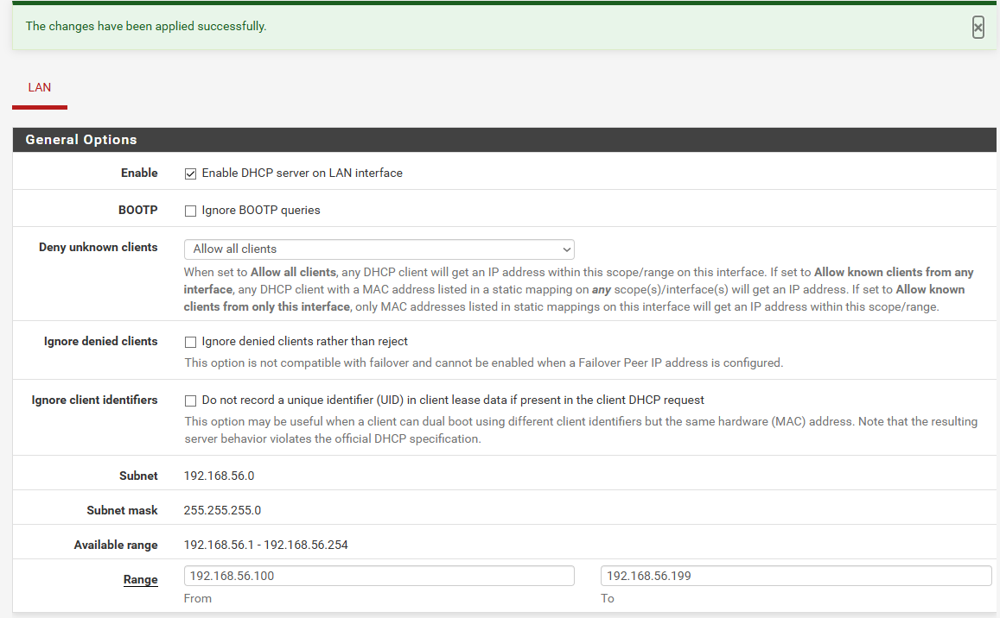

avec la gateaway : 192.168.56.103

Questions :

Pourquoi utiliser DHCP plutôt qu’une IP fixe ?

    - Pour assigner et réassigner automatiquement les adresses IP

Quelle plage d’adresses choisir ?

    - 192.168.56.1 à 192.168.56.254

Quelles adresses faut-il éviter d’inclure dans la plage ?

    - 192.168.56.100 et 192.168.56.199

Vérification :

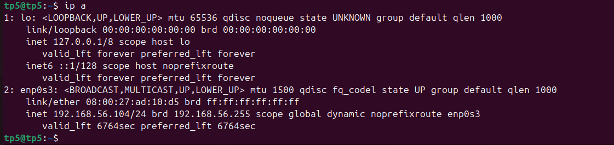

Ubuntu obtient-elle automatiquement une adresse IP ?

    - Oui

5. DNS

Activez et configurez le résolveur DNS.

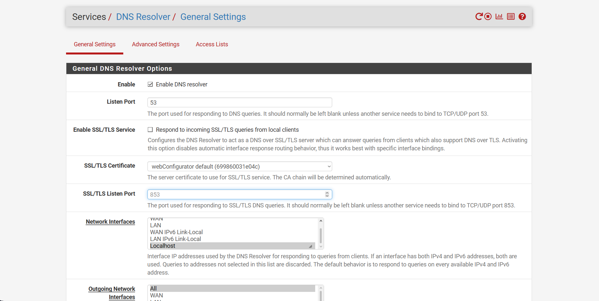

Questions :

Pourquoi un pare-feu peut-il jouer le rôle de serveur DNS ?

    - Parce que le pare eu empèche l'accès a certain logiciel malvaillant passant par le dns

Que se passe-t-il si le DNS ne fonctionne pas mais que le ping vers 8.8.8.8 fonctionne ?

    - Si le ping vers 8.8.8.8 fonctionne mais que le DNS ne répond pas, l’ordinateur peut atteindre Internet par IP mais ne peut pas résoudre les noms de domaine.

# Partie 4 – Autoriser l’accès Internet

6. Règles de pare-feu

Configurez les règles nécessaires pour permettre aux machines du LAN d’accéder à Internet.
info :
pfSense applique les règles de haut en bas.

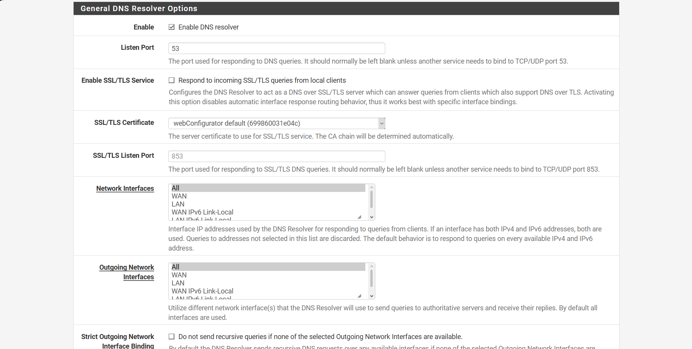

Questions :

Quelle doit être la source ?

    - LAN net

Quelle doit être la destination ?

    - tout le monde 

Faut-il autoriser tous les protocoles ?

    - TCP/UDP

Tests :

Ping vers pfSense
Ping vers 8.8.8.8
Test DNS
Accès web

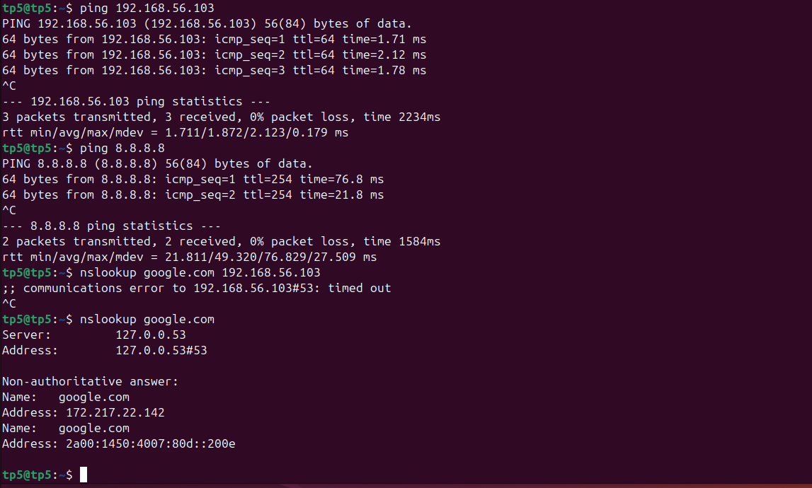
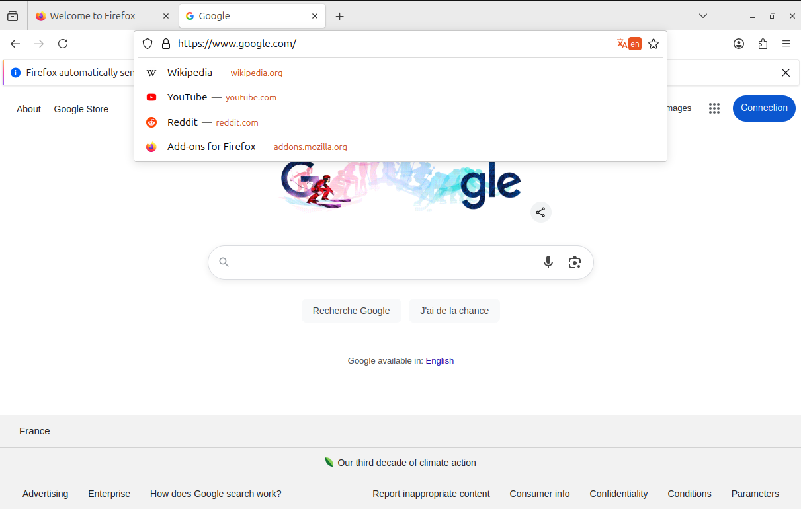

Si ça ne fonctionne pas :

Où regarder ? (Logs ? NAT ? Règles ?)

    - Firewall → NAT

    - status -> systemlog

    -fire wall -> rules

7. NAT

Vérifiez la configuration du NAT sortant.

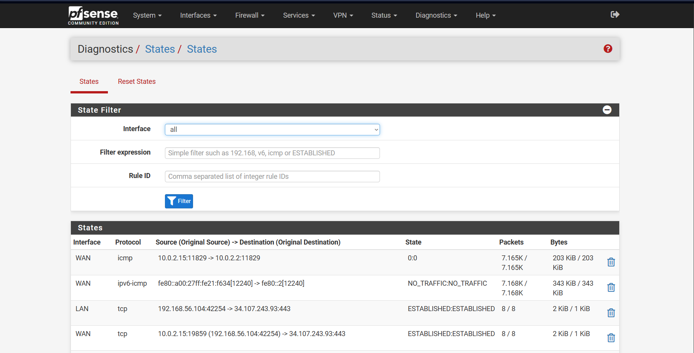

Questions :

Pourquoi le NAT est-il nécessaire avec une interface WAN en NAT ?

    - Le NAT permet aux machines du LAN avec des IP privées d’accéder à Internet en utilisant l’IP publique du WAN.

Quelle est la différence entre NAT automatique et manuel ?

    - Le NAT automatique crée les règles de traduction automatiquement, tandis que le NAT manuel demande de les configurer soi-même.

Comment vérifier qu’une traduction d’adresse a lieu ?

    - On peut vérifier dans Diagnostics → States.

# Partie 5 – Filtrage

8. Blocage d’un site spécifique

Bloquez l’accès à un site web de votre choix.

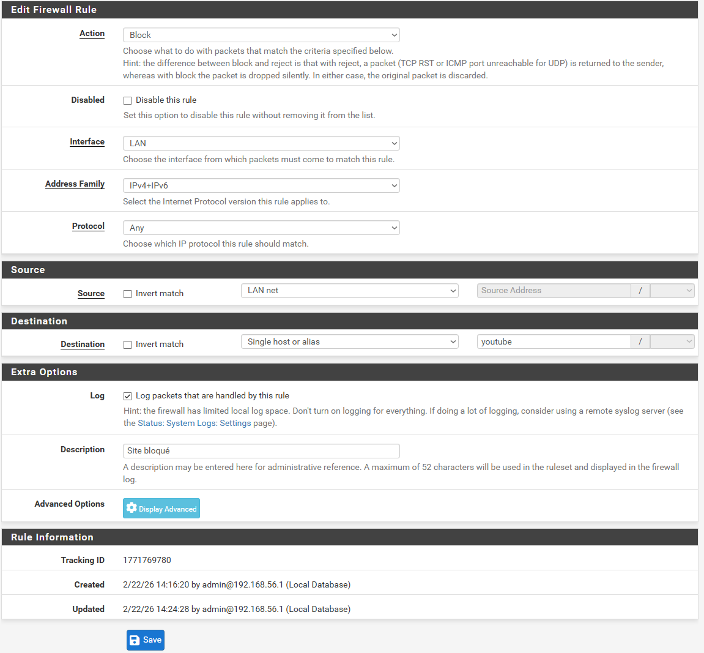

Questions :

Faut-il bloquer par IP ou par nom de domaine ?

    - Par nom de domaine car l'ip peut changer

Que se passe-t-il si le site utilise HTTPS ?

    - Le pare-feu ne peut pas inspecter le contenu, mais il peut bloquer le site via le nom de domaine .

Pourquoi le blocage par IP peut-il être contourné ?

    - Car les sites peuvent changer leur ip ou en avoir plusieurs.

Testez et observez les logs.

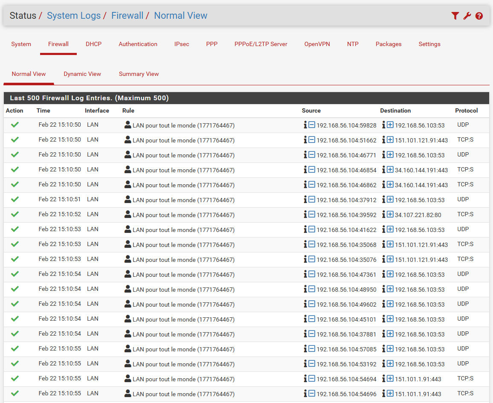

9. Blocage d’une catégorie de sites (jeux d’argent)

Créez une solution propre et maintenable pour bloquer plusieurs sites.
tips : réfléchissez à l’intérêt des alias.

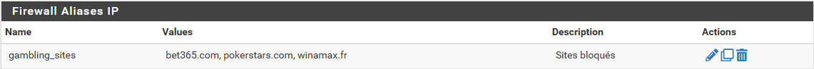

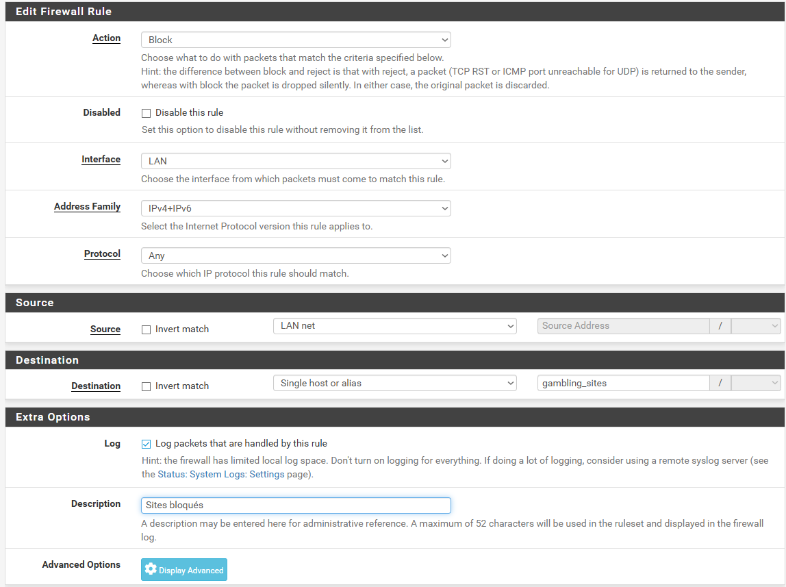

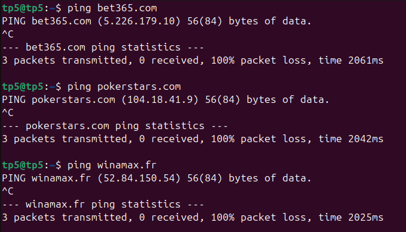
Questions :

Pourquoi ne pas créer une règle par site ?

    - Par ce que c'est trop long et que l'on creer des sites tout les jours

Où se créent les alias ?

    - Dans Firewall → Aliases, puis on peut créer un alias de type Host ou URL List pour plusieurs domaines.

Comment vérifier qu’une règle bloque réellement le trafic ?

    - En observant les logs du pare-feu (Firewall → Log Files) ou en testant l’accès depuis une machine du LAN.

# Partie 6 – Aller plus loin (partie plus tendue)

10. Blocage par catégorie (réseaux sociaux)

Créez un alias pour une nouvelle catégorie.
Implémentez une règle.
Analysez les logs.

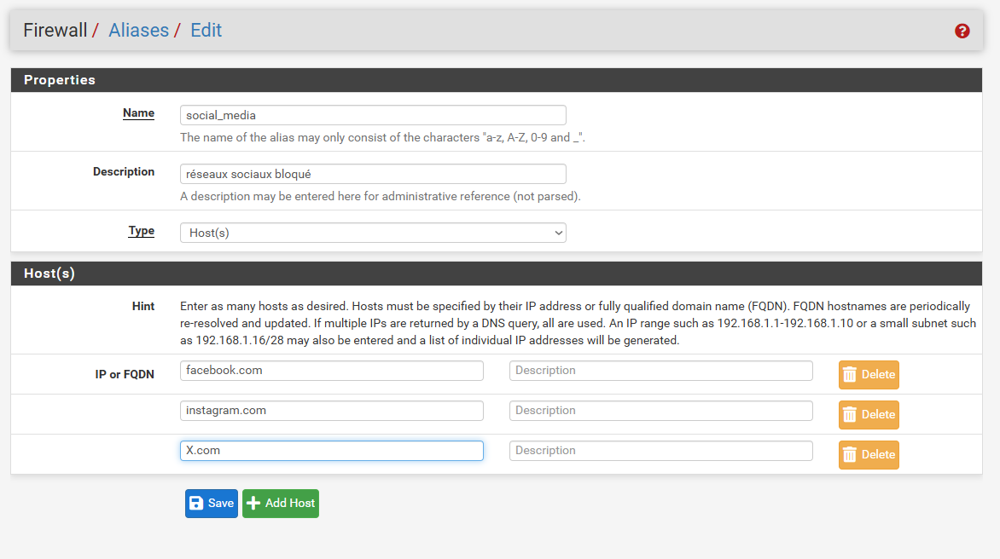

Question :

Que se passe-t-il si la règle est placée sous une règle "Pass Any" ?

    - La règle ne sera jamais appliquée, le trafic sera autorisé par la règle “Pass Any” au-dessus.

11. Règles horaires

Créez un horaire.
Appliquez-le à une règle existante.

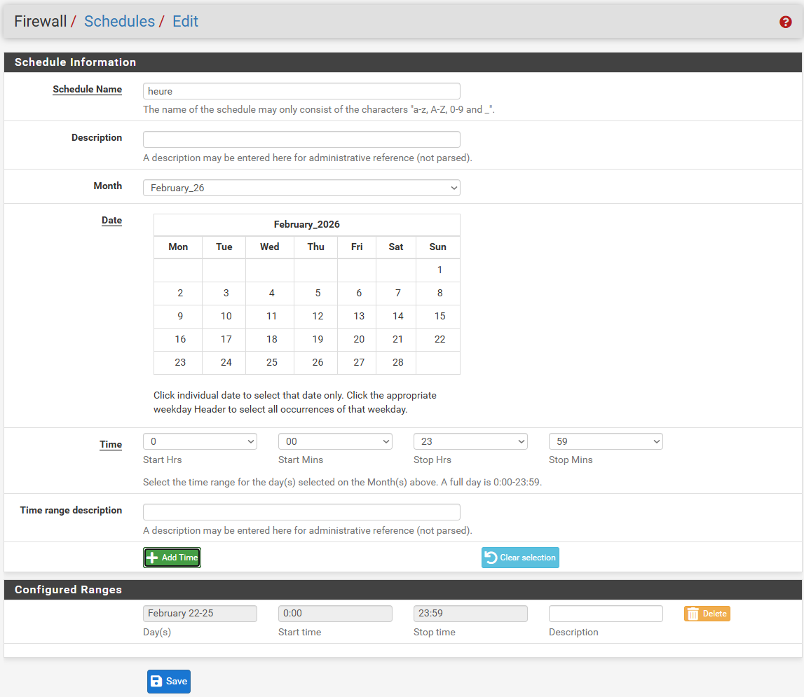
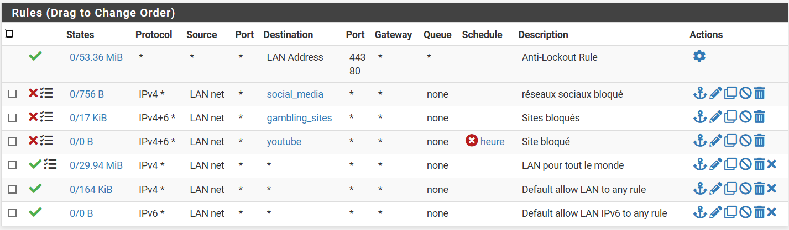

Questions :

Pourquoi les règles horaires sont-elles utiles en entreprise ?

    - Pour limiter l’accès à certaines ressources en heures ouvrables ou éviter des usages non autorisés en dehors des horaires.

12. Serveur web local

Installez un serveur web sur Ubuntu.
Objectifs :

Autoriser un accès spécifique
Bloquer les autres

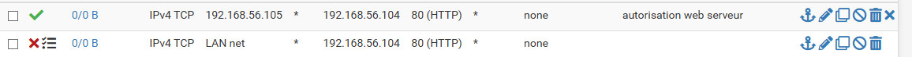

Questions :

Filtrer par IP source ?

    - pour limiter l’accès à certains clients

Filtrer par port ?

    - limiter les services accessibles (HTTP/HTTPS)

Pourquoi le pare-feu protège-t-il le LAN même en réseau interne ?

    - Parce que tout trafic traverse le firewall et doit respecter les règles, même dans le LAN

13. Logs et analyse

Activez la journalisation sur certaines règles.

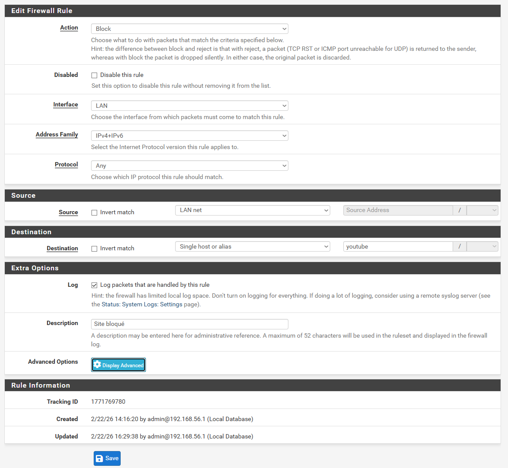

Questions :

Différence entre paquet bloqué et autorisé

    - montre si le paquet a été rejeté ou laissé passer

Identifier quelle règle a déclenché le blocage

    -montre si le paquet a été rejeté ou laissé passer

Comprendre le sens du trafic

    -source, destination, port, protocole

14. DMZ

Mettez en place une zone DMZ.

Pas assez de ressource

Questions :

Qu'est ce qu'une DMZ ?

    - zone isolée pour services accessibles depuis Internet

Pourquoi isoler un serveur ?

    - sécurité, un serveur compromis ne touche pas le LAN

Une machine en DMZ peut-elle accéder au LAN ?

    - Normalement non

Le LAN peut-il accéder librement à la DMZ ?

    - Seulement si règle explicite

15. Filtrage MAC

Testez le filtrage par adresse MAC.

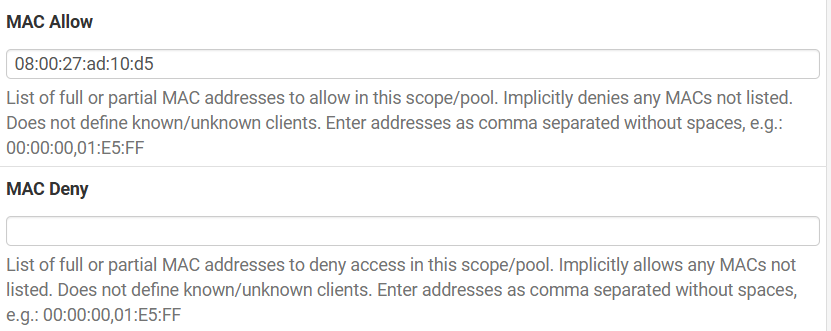

Question :

Le filtrage MAC est-il réellement sécurisé ?

    - Non, MAC peut être spoofée

Pourquoi est-il facilement contournable ?

    - on peut changer l’adresse MAC du client

16. Portail captif

Implémentez un portail captif.

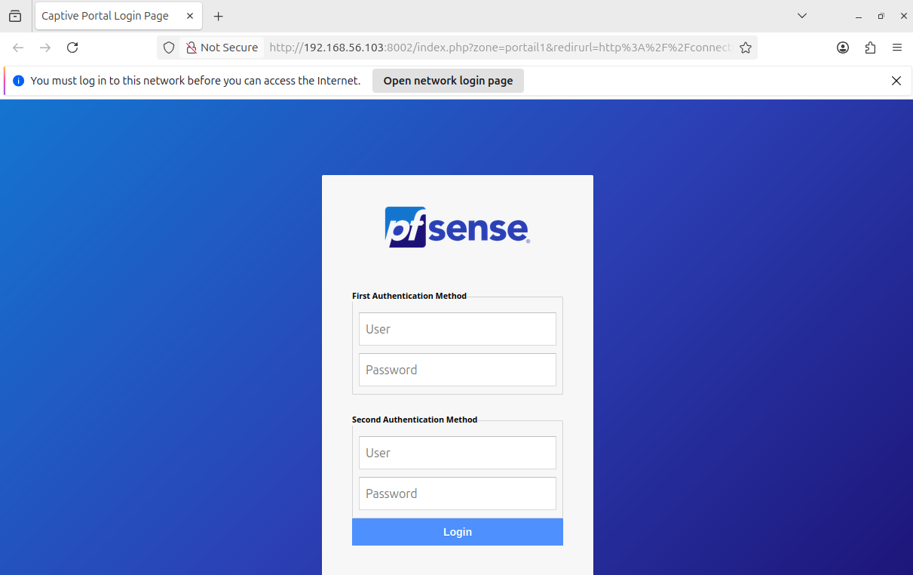

Questions :

Dans quels contextes utilise-t-on cela ?

    - Wi-Fi public, invités

Quelle(s) avantage(s) avec une simple règle de pare-feu ?

    - permet authentification et suivi par utilisateur, pas juste blocage IP

17. Sauvegarde / restauration

Sauvegardez la configuration.
Modifiez-la.
Restaurez-la.

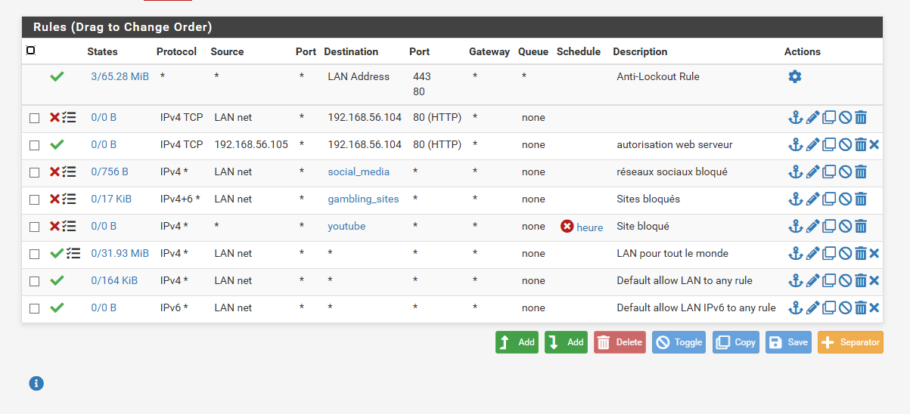

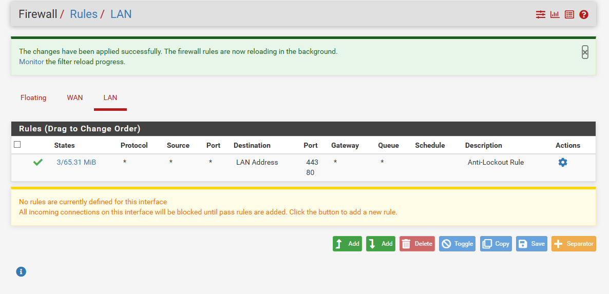

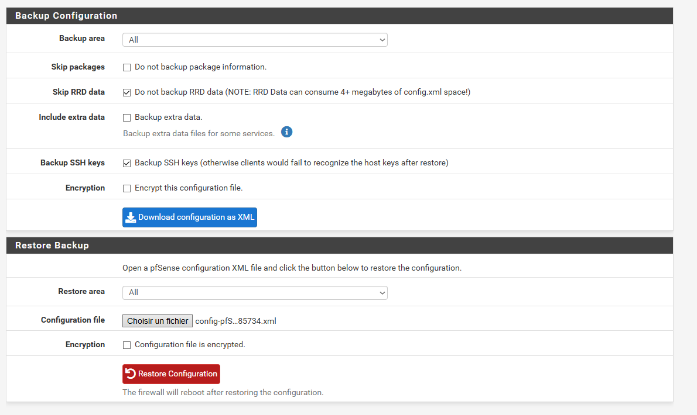

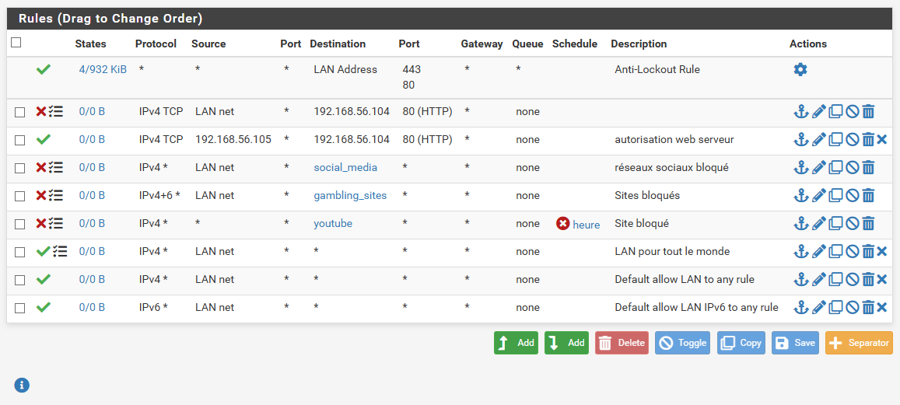

Question :

Pourquoi la sauvegarde régulière est-elle essentielle en production ?

    - Restaurer rapidement après erreur ou panne et éviter de tout reconfigurer à la main
